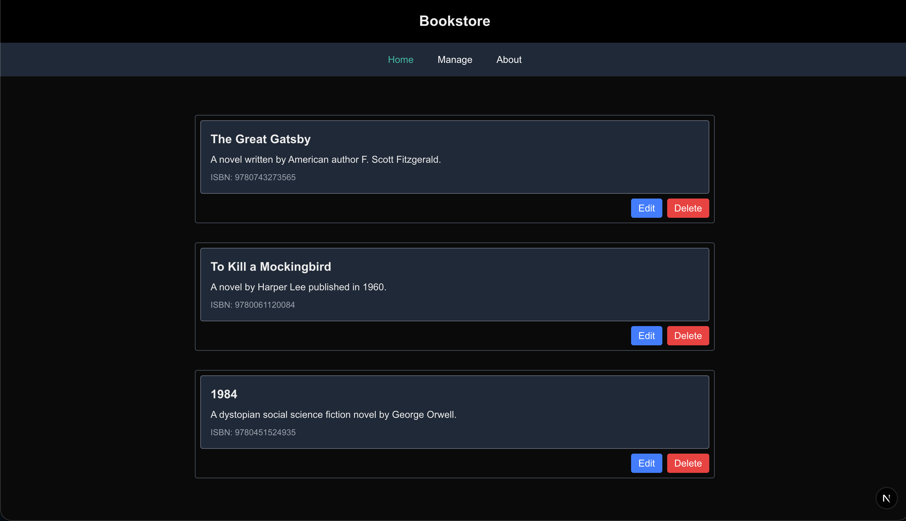

# Bookstore
The project is intended to be a website that displays a list of books that the user added.

## Feature list
### API endpoints:

**Add** -  
Handle an incoming request to add a new book. 

POST /api/books

**Get** -  
Handle a request to display all the books.

GET /api/books  
GET /api/books/:id

**Update** -  
Handle a request to update book information.

PUT /api/books 

**Delete** -  
Handle a request to remove a book.

DEL /api/books/:id

## Technology stack
### Front-end implementation:
- Technology/Language: React/Nextjs/Typescript

### Back-end implementation:
- Technology/Language: Bun/Typescript

### Database implementation:
- Provider: Atlas MongoDB
- Database: MongoDB

